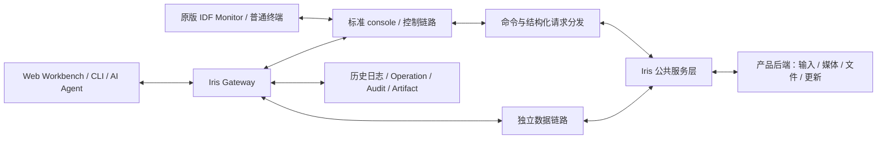

# ESP-Iris 软件规格书

| 项目 | 内容 |
| --- | --- |
| 文档修订 | 第 4 版：0.2 实现与验证状态 |
| 修订日期 | 2026-10-09 |
| 文档状态 | 0.2 规格；实现已落地，验证范围与限制见第 12 节 |
| 产品定位 | 标准 ESP-IDF monitor/console 工作流的可选增强 |
| 适用范围 | 通用 ESP-Iris 设备组件、Developer Gateway、Workbench、CLI/API |
| 目标版本 | 设备／主机协议代际 0.2；ESP-Iris 与配套主机首个目标发布版 0.2.0 |
| 实现基线 | 组件与主机 0.2.0；wire/API 2，无 0.1 兼容层 |
| 首要验证平台 | ESP32-S31；其他目标按接口能力与验证矩阵声明支持 |
| 许可证 | Apache-2.0 |

## 1. 文档目的与规范用语

本文定义重构后的产品定位、系统边界、功能要求、兼容要求和验收标准。核心变化是保留标准 console，将 Iris 控制能力作为命令与 API 扩展，并将连续媒体、文件和固件内容移到独立链路。按需截图可使用控制链路的有界分块传输。

本文是目标规格，不是当前实现已经满足全部要求的声明。第 12 节单独说明实现差距和历史验证的适用范围。0.2 与 0.1 不互通；迁移仅通过文档指导升级和重新配置，不在新代码中保留兼容层。历史协议定义与证据按原版本归档，不重新解释。

- **必须／不得**：已确认的兼容边界或验收要求。
- **应**：目标实现应满足的行为；差异需要在设计和验收记录中说明。
- **可选**：由产品配置、服务注册或链路能力决定，必须可查询其可用性。
- **候选／待定**：尚未确定的实现选择，不是现有 API、协议常量或部署结果。

文档修订号、组件发布版本与线上协议版本分别管理。0.2 是新协议代际，首个目标发布版为 0.2.0；具体线上的版本字段编码由 0.2 协议契约规定，不能据此沿用旧 v1 信封。

## 2. 产品定位与目标

ESP-Iris 为 ESP32 提供结构化观测、运行时控制、数据访问和可追溯的更新工作流。开发者可以使用原版 `idf.py monitor` 或普通串口终端查看日志、输入设备命令，也可以使用可选的 Iris 主机程序，通过 Web、CLI 和 API 操作同一套设备服务。

普通调试不依赖 Gateway。需要多设备管理、Web/AI 访问、历史记录、文件处理和媒体展示时，由 Gateway 提供这些主机能力。原版 monitor 不需要理解 Iris 的 Web API、图片格式或升级包，也不因设备增加命令就自动获得这些主机功能。

重构应解决以下问题：

1. Iris 接管 stdout/stderr、串口和复位行为，破坏已有 ESP-IDF 调试工作流。
2. 日志、控制和媒体共用二进制链路，普通工具不能直接读取 console。
3. 运行时状态、RPC、任务、文件和固件操作需要明确的机器接口与结果关联。
4. 断线、设备重启和 Gateway 重启后，长期操作需要保留可查询状态与证据。
5. 多设备、远程环境和有限设备资源需要统一身份、访问协调和有界资源管理。

“现有功能不减少”指：在具备数据链路且产品启用相应服务时，保留现有 Iris 能力。只有 UART 或 USB Serial/JTAG 时，仍可提供按需截图与有界诊断对象读取；允许不提供连续画面、音频、文件内容和固件传输。服务可用性由后端注册、授权与传输能力共同决定，不以吞吐相同为目标。

## 3. 术语

| 术语 | 定义 |
| --- | --- |
| 标准 console | ESP-IDF 的日志与标准输入输出路径；应用可在其上提供交互命令 |
| IDF Monitor | 原版 `idf.py monitor` 调用的主机监视工具；不负责实现设备命令 |
| 控制链路 | 承载文本日志、命令、结构化请求／响应、有界事件及按需对象分块的连接 |
| 数据链路 | 与控制链路分离、承载媒体或大块对象内容的连接 |
| Gateway | 可选的 PC／服务器侧 Iris 服务，提供设备管理、操作编排、存储和 API |
| Workbench | 通过 Gateway 访问设备的 Web 工程界面 |
| Agent | 通过 CLI、REST 或 WebSocket 使用 Gateway 的自动化或 AI 客户端 |
| RPC / Job | 有界远程调用／可查询进度、结果并请求取消的长期设备任务 |
| `device_id` / `boot_id` | 稳定设备身份／一次设备启动的标识 |
| 控制会话／数据会话 | 分别拥有身份、授权与生命周期；可关联，但数据会话不从属于控制会话 |
| 传输任务 | 由任务标识、对象或流标识、设备与启动身份及授权范围确定的一次传输 |
| `request_id` / `operation_id` | 一次请求／可持久查询的主机长期操作的标识 |
| Artifact | 主机保存的截图、固件、文件、Core Dump 等制品 |
| ROM Download Mode | 芯片内置下载程序；其中不运行 ESP-Iris |
| Recovery | 产品可注册的恢复入口与策略；通用 Iris 不规定其固件、布局或触发按键 |

Iris 会话、媒体订阅与传输任务可以具有生命周期，但不得要求用户将 console 切换成另一种全局通信模式。固件升级引起的重启或调用产品恢复入口属于设备操作，不属于 console 协议模式切换。

## 4. 已确认的需求基线

| 编号 | 需求 |
| --- | --- |
| BR-01 | 不安装 Iris 主机扩展、不启动 Gateway，原版 `idf.py monitor` 必须能直接使用。 |
| BR-02 | 集成 Iris 的固件保留标准 console、文本日志和产品命令。 |
| BR-03 | 原版 monitor 与 Iris 主机互斥使用控制端口；不要求二者并行使用设备服务。 |
| BR-04 | 命令/API 不需要进入专用通信模式，不需要为此改配置、重新烧录或重启。 |
| BR-05 | 连续画面、音频、文件和固件内容使用独立数据链路；按需截图允许经控制链路有界分块读取。 |
| BR-06 | High-Speed USB 同时提供 console 与独立数据功能接口；TCP 使用独立控制和数据端口。 |
| BR-07 | UART／USB Serial-JTAG 保留日志、RPC、Job、输入及已注册的按需截图；数据专用功能可不支持。 |
| BR-08 | 原生 `idf.py flash monitor` 和 OpenOCD/JTAG 可用；第三方工程无需集成 Iris 或修改其分区表。 |
| BR-09 | 数据链路自动发现并在自身握手中完成身份、版本和授权绑定，无需先向控制链路申请或确认。 |
| BR-10 | Gateway 自动重连 UART／USB Serial-JTAG，尽早采集包括 bootloader 在内的原生日志，提供硬件复位与受控复位采集。 |
| BR-11 | 保留现有设备服务、Workbench、主机 API、证据和操作管理能力；以功能迁移验收，不要求旧接口字节兼容。 |
| BR-12 | ESP-Iris 为通用底层组件；产品分区、启动策略、升级路径及专用 CLI 由产品模块定义。 |
| BR-13 | 0.2 与 0.1 不互通；无旧解析器、自动降级或兼容适配层，只提供文档迁移指南。 |

第三方兼容的前提是示例支持目标芯片，且 Flash、引脚、外设、console 与调试器配置适用于开发板。Iris 不约束第三方工程的分区布局。

## 5. 系统架构

### 5.1 逻辑结构

原版 monitor 与 Gateway 两条控制访问路径互斥。Gateway 工作期间，Workbench、CLI 和多个 Agent 可以通过同一个 Gateway 协同，不需要让原版 monitor 同时占用设备。

### 5.2 职责与所有权

| 层 | 职责 | 边界 |
| --- | --- | --- |
| Console 适配 | 保留标准输入输出，接入产品命令，区分请求与普通输入 | 不把 stdout/stderr 改为仅 Iris 客户端可读的输出 |
| 控制协议 | 命令解析、请求关联、状态、事件与按需对象分块 | 不承载连续媒体、文件或固件内容流，不执行 HTTP |
| 数据传输 | 有界分帧、分块、校验、流控和连接绑定 | 不自行授予文件或 Flash 写入权限 |
| Iris 服务 | RPC、Job、媒体、文件、Crash、OTA、Inventory 与 System Update | 服务语义独立于 UART、USB 和 TCP |
| 产品适配 | UI/输入、文件卷、网络生命周期、分区和恢复策略 | 通用 Iris 不内置具体产品的固定地址、模式或命令 |
| Gateway | 主机连接、能力发现、操作、历史、认证与制品 | 普通 monitor 不依赖其运行 |
| Workbench/CLI/Agent | 展示、请求及结果观察 | 不直接占用 Gateway 已持有的物理连接 |

Console 驱动和 USB 设备栈必须有明确的单一所有者。Iris 可拥有其专用数据接口与服务资源，但启动、停止或释放 Iris 会话不得卸载仍被 console 或其他 USB 功能使用的驱动。

设备侧不要求运行 HTTP Server、WebSocket Server、Web UI 或数据库。控制编码不得强制产品引入大型 JSON 解析依赖；PC API 可以继续使用 JSON。主机复用 IDF Monitor 能力的具体代码方式待设计，不将修改已安装的原版 monitor 设为用户前置条件。

## 6. 链路与协议规格

### 6.1 接口能力矩阵

| 接口 | 标准日志与命令 | Iris 状态、RPC、Job、输入、按需截图 | 独立大数据链路 |
| --- | --- | --- | --- |
| UART | 必须支持 | 支持已注册服务，截图依赖后端 | 本版不要求 |
| USB Serial/JTAG 串口 | 必须支持 | 支持已注册服务，截图依赖后端 | 本版不要求 |
| High-Speed USB console CDC | 必须支持，原版 monitor 可直接连接 | 支持已注册服务 | 通过另一个 USB 功能接口提供 |
| TCP 控制端口 | 提供文本控制语义；客户端入口单独定义 | 支持已注册服务 | 通过另一个 TCP 端口提供 |

TCP 文本接口不意味着所有版本的原版 `idf.py monitor` 都已支持该网络 URL。原版 monitor 的直接兼容验收覆盖 UART、USB Serial/JTAG 和应用 console CDC；TCP 客户端入口及支持版本需要单独验证。

High-Speed USB 应以复合设备形式同时枚举 console 与数据接口。数据接口可以选第二个 CDC 或自定义 Bulk，具体类别待设计验证；不得依靠运行中改描述符、重新枚举或切换整个 USB 设备来开始传输。USB Serial/JTAG 是固定功能控制器，不要求为其增加 USB 数据接口。

原生 ROM 烧录使用芯片和板卡支持的 UART／USB Serial/JTAG 等下载路径。应用 High-Speed USB 的 CDC 或数据接口不能自动视为 ROM 下载端口；如需不同端口烧录和监视，应明确端口映射。

### 6.2 标准 console 与命令

| 编号 | 规格 |
| --- | --- |
| FR-CON-01 | Iris 未启动、未连接或停止后，标准日志和产品 console 输入必须保持可用。 |
| FR-CON-02 | 正常运行期间，`ESP_LOGx`、`printf`、stdout/stderr 输出应保持原生可读；额外日志留存不得吞掉标准输出。 |
| FR-CON-03 | 平台支持的启动早期、bootloader、panic、backtrace、Core Dump 和 GDB Stub 诊断路径不得依赖 Iris Worker 正常工作，或被 Iris 接管破坏。 |
| FR-CON-04 | 设备命令应接入 ESP-IDF console 或产品现有命令分发，不得启动第二个读取同一 stdin 的竞争任务。 |
| FR-CON-05 | 人工命令与结构化请求应调用同一公共服务层，保持权限、参数验证、错误及业务结果一致。 |
| FR-CON-06 | 默认只输出正常日志和产品提示，不周期性向普通 console 注入二进制 HELLO、心跳或数据帧。 |
| FR-CON-07 | 原版 monitor 的退出、复位、过滤、符号解析及适用配置下的调试快捷键必须可用。 |
| FR-CON-08 | Iris 不得为维持连接而长期禁止 USB Serial/JTAG 的标准复位／下载行为；连接动作与主动复位应区分。 |
| FR-CON-09 | 未知、截断或超长命令应有界报错并恢复解析，不得影响后续合法输入。 |

命令可以组织为 `iris status`、`iris rpc …`、`iris jobs …` 等命名空间；这些是设计示意，不是本次文档新增的可执行接口。最终命令名、帮助、参数、转义和机器格式应形成单独契约。

启动和异常诊断按芯片、IDF 配置与接口实际能力验收。应用 TinyUSB CDC 在其驱动初始化前不提供应用 console，不能据此承诺它覆盖 ROM／bootloader 输出；需要早期或故障日志时，应保留可用的 UART／USB Serial-JTAG 等原生路径并说明覆盖范围。

### 6.3 结构化控制

控制接口必须同时满足人工可用和程序可靠解析。不能让 Agent 从自由格式业务日志猜测请求是否完成，也不能以“进入机器模式”为前提停止普通 console 服务。

| 编号 | 规格 |
| --- | --- |
| FR-CTL-01 | 机器请求／响应应具有明确的记录边界、版本、请求标识、错误结果和长度限制；编码对文本 console 安全。 |
| FR-CTL-02 | 控制记录与日志交错时必须能可靠区分；需定义转义和串行写出规则，不能把任意日志行当作可信响应。 |
| FR-CTL-03 | 长操作以 Job／Operation 返回句柄和进度，不能一直占住命令处理器而使状态查询失效。 |
| FR-CTL-04 | 日志和结构化事件订阅按请求建立、取消并有资源上限；普通终端无需完成 Iris 握手才能读日志。 |
| FR-CTL-05 | 超时或断线后，未知结果的修改请求不得自动重放；重试、去重和查询语义必须明确。 |
| FR-CTL-06 | RPC 参数和响应可采用可打印编码；限制每条记录、每个分块及驻留资源，不以单条 RPC 上限限制整个截图对象。 |
| FR-CTL-07 | 按需对象读取使用声明的描述、分块、取消／释放接口；不得自动把连续媒体、任意文件或固件降级为控制链路传输。 |
| FR-CTL-08 | 分块大小、并发、速率与超时可协商或查询；日志、取消和状态有调度预算，大量分块不得长期独占 console。 |

控制链路上的身份、版本和认证协商属于普通控制请求，不改变 console 的解释模式；数据链路独立完成自己的握手。原版 monitor 可以输入设备命令，但 HTTP API、制品保存及图片显示仍由可选主机程序提供。

### 6.4 独立数据链路

| 编号 | 规格 |
| --- | --- |
| FR-DATA-01 | 连续画面、音频、文件、固件和系统更新内容使用数据链路；按需截图优先使用数据链路，无数据链路时按第 7.3 节读取。 |
| FR-DATA-02 | 数据端点通过 USB 枚举、网络服务发现或已配置地址自动发现并连接；控制接口可返回端点提示，但不是发现、建立或认证的前置条件。 |
| FR-DATA-03 | 数据握手独立验证 0.2 版本、`device_id`、`boot_id`、能力与授权，并建立数据会话；无控制会话时也能完成。 |
| FR-DATA-04 | USB 复合父设备、序列号和接口描述用于筛选候选；不得仅按相邻端口号配对，须用握手确认设备与本次启动身份。 |
| FR-DATA-05 | TCP 的 mDNS、地址或同一 IP 仅提供发现线索；数据握手必须独立认证和防重放，不接受未经验证的会话归属。 |
| FR-DATA-06 | 连接归属与任务归属分开：连接可以先建立；传输开始前关联任务／流／对象、设备与启动身份、数据会话及授权主体，存在控制会话时记录其关联。 |
| FR-DATA-07 | 数据记录包含长度、类型、流标识、顺序和错误检测；对象传输验证最终完整性；所有流均有有界缓冲和流控。 |
| FR-DATA-08 | 数据断开不关闭健康 console；控制短暂断开不强制关闭健康数据会话。任务声明可独立继续、暂停或取消的策略，不能把所有任务自动视为可继续。 |
| FR-DATA-09 | 设备重启、授权失效或撤销、明确释放设备、任务终止时，按生命周期失效相应绑定；旧启动、旧授权或旧任务不得继续写入。 |
| FR-DATA-10 | 媒体可采用有界丢弃，文件／固件要求可靠传输；数据重连不得自动重放提交或把未知结果当成失败后重试。 |

自动绑定是自动完成验证，不是省略验证。数据握手只交换身份、授权和绑定元信息，不要求复制全部控制服务。TCP 使用预先配对的凭据完成独立 Challenge-HMAC 认证；首次配对仍需要产品允许的凭据配置，不能因为可发现就视为已授权。

“独立链路”允许同一根 USB 线上的不同功能接口，或同一网卡上的不同 TCP 端口，不表示独立物理带宽。一个数据连接可以复用多个逻辑流。设备可先建立数据会话，但实际业务只接受已授权、符合服务状态的任务；自动发现不授予设备所有权或写权限。

### 6.5 会话、端口所有权与能力发现

| 编号 | 规格 |
| --- | --- |
| FR-TR-01 | 产品可配置 UART、USB Serial/JTAG、High-Speed USB 和 TCP 中的适用接口，驱动能力按目标验证。 |
| FR-TR-02 | 每台设备最多一个 Iris 活动控制会话；同一设备所有者可持有独立数据会话。所有修改按设备协调，不能因多链路而出现多个写入所有者。 |
| FR-TR-03 | monitor 与 Iris 主机互斥持有控制端口；Gateway 释放设备后不得自动抢回供原生工具使用的端口。 |
| FR-TR-04 | 打开或枚举端口不等于获得有效会话；遇到占用应明确返回，不得强制终止其他客户端。 |
| FR-TR-05 | 能力发现必须区分服务是否存在、产品是否启用、当前是否授权，以及所需数据链路是否可用。 |
| FR-TR-06 | 按需截图可选择控制路径并显示较低吞吐；数据专用功能缺少数据链路时快速返回明确原因，不得伪装成功或无限等待。 |
| FR-TR-07 | 重连使用有界退避；回收已终止连接的请求、订阅和临时缓冲，不误清理按任务策略仍有效的独立会话或快照。 |
| FR-TR-08 | 保留 TCP 配对和网络发现；mDNS 等公告应描述新控制／数据入口及版本，避免误指向旧二进制服务。 |

不要求在一个未扩展的 monitor 正占用串口时，由其他工具无感接管。退出客户端或释放主机端口是资源交接，不是设备通信模式切换。Gateway 显式交还设备时应停止相关任务、释放控制和数据所有权并暂停重连；这不同于控制链路短暂掉线，也不要求支持 monitor 占用期间的 Iris 数据操作。

## 7. 功能规格

以下功能按服务注册和当前链路能力提供。控制路径保留身份、日志、状态、RPC、Job、输入和可用元数据；大数据内容受第 6 节约束。

### 7.1 身份、状态、日志与证据

| 编号 | 规格 |
| --- | --- |
| FR-OBS-01 | 沿用稳定硬件身份定义，同一设备不同应用或恢复固件使用相同 `device_id`；重启产生新的 `boot_id`，不因协议升级重新分配设备身份。 |
| FR-OBS-02 | 状态包含固件、生命周期、控制／数据可用性、Uptime、错误统计、日志丢弃、内存与栈水位。 |
| FR-OBS-03 | Iris 日志留存或主机慢消费不得为标准输出新增无界等待；原生 console 驱动自身的阻塞行为单独测量。 |
| FR-OBS-04 | 日志使用有界 Ring，溢出记录丢失范围或计数；原生日志与结构化留存需避免重复、递归和乱序。 |
| FR-OBS-05 | Gateway 保留历史索引、轮转和 Follow；UART／USB Serial-JTAG 自动重连，端口可读即采集原始字节，不等待 Iris 初始化、握手或身份查询完成。 |
| FR-OBS-06 | 事件在适用时关联设备、启动、会话、请求、Job、Operation、固件 SHA 和 Artifact。 |
| FR-OBS-07 | 保留内部 RAM、PSRAM、任务栈水位和系统清单查询；采样有界，不持续扫描任务栈。 |
| FR-OBS-08 | Gateway 缓存、端口名和历史截图必须与实时状态区分，不得用历史证据证明当前固件健康。 |
| FR-OBS-09 | 保留崩溃日志历史与 Core Dump 集成；向主机发送日志不得立即清除用于崩溃分析的留存记录，历史按有界容量覆盖。 |

### 7.1.1 启动日志与重连

| 编号 | 规格 |
| --- | --- |
| FR-LOG-01 | 在 UART／USB Serial-JTAG 支持的输出路径上，采集 ROM／bootloader／应用日志；无 Iris、Iris 尚未启动或应用异常时仍可读取原始日志。 |
| FR-LOG-02 | 身份未知时先以端点、捕获段和主机时间保存原始数据；握手后补充关联，无法确定启动归属的片段保留“未知”，不得套用旧 `boot_id`。 |
| FR-LOG-03 | 受控复位必须先建立读取与存储，再执行复位并持续读取；不在复位后清空输入缓冲，不以可打印或协议解析成功作为保存前提。 |
| FR-LOG-04 | 同一设备重枚举后按稳定线索寻找端点并重新验证身份，采用有界退避；端口号改变不切换到其他设备。 |
| FR-LOG-05 | 普通重连采用不主动复位的附着策略；连接失败不得触发无限重置，调试暂停不得被误当成应复位的故障。 |
| FR-LOG-06 | 断开期间仅补取设备实际留存的日志；记录主机捕获缺口、设备报告的丢失与身份不确定性，不把“已重连”报告为“完整捕获”。 |
| FR-LOG-07 | 原始串口日志与应用结构化日志分别保留来源和顺序依据；合并展示时避免重复，不伪造缺失的设备时间戳或严格全局顺序。 |

“从 bootloader 开始完整采集”的验收前提是：固件启用了该输出、所选接口覆盖该阶段、主机读取在复位前就绪，且硬件链路或缓冲没有丢失。USB Serial/JTAG 的缓冲有限，复位后的重枚举可能形成窗口；自动重连不能恢复已经丢失的字节。平台无法完整覆盖时必须标明缺口，不能仅以应用连通通过完整启动采集验收。

### 7.1.2 硬件复位

| 编号 | 规格 |
| --- | --- |
| FR-RST-01 | Gateway 提供正常运行复位、进入 ROM Download Mode 及不复位附着；这些能力不依赖设备提供 Iris RPC。 |
| FR-RST-02 | UART 自动复位使用板级支持的 DTR/RTS 控制信号；USB Serial/JTAG 使用芯片支持的控制线复位／下载时序，与 IDF Monitor／esptool 的适用策略对齐。 |
| FR-RST-03 | 提供目标／板卡复位策略及必要的自定义时序；未接线或平台不支持时报告能力不足，不能假定全部串口都能复位。 |
| FR-RST-04 | 复位前协调设备所有权与进行中的写入、调试任务；主动复位记录触发原因、执行结果、前后身份及日志捕获段。 |
| FR-RST-05 | 打开、关闭和重连串口应控制 DTR/RTS 的副作用；异常处理和普通发现不附带未经请求的复位。 |

这里的 UART 输出控制信号是 **DTR/RTS**；CTS 是主机读取的流控输入，不能作为通用硬件复位驱动信号。复位请求成功发出、进入 ROM 和重新启动应用是不同结果；API 与 Workbench 必须分别表达。

### 7.2 RPC、Job 与输入

| 编号 | 规格 |
| --- | --- |
| FR-RPC-01 | 保留产品注册／注销 RPC Handler 的能力；内部有界二进制参数 API 可与外部文本控制编码解耦。 |
| FR-RPC-02 | RPC 保留服务、方法、请求标识及 Deadline 语义，并提供明确的参数和错误契约。 |
| FR-RPC-03 | Handler 数量、单次请求与响应大小有配置上限；大对象使用对象句柄，按服务能力通过数据链路或控制分块接口读取。 |
| FR-JOB-01 | 保留 Job 创建、进度更新、查询、完成及取消请求。 |
| FR-JOB-02 | Job 区分运行、成功、失败、取消等状态并报告结果；取消请求不等于取消已完成。 |
| FR-JOB-03 | 长任务不得阻塞基本状态、停止订阅和取消请求；终态及断线后的可查询范围必须明确。 |
| FR-IN-01 | 保留指针、触控及产品输入接口，复用 RPC 或输入适配层。无数据链路仍可使用已注册输入功能；输入调用成功不代表已获得屏幕反馈，反馈须以实际取得的截图或图像帧为准。 |

### 7.3 截图、图像与音频

| 编号 | 规格 |
| --- | --- |
| FR-MED-01 | 保留按需截图后端与连续镜像；按需截图可经数据链路或控制分块读取，连续镜像和音频必须使用数据链路。 |
| FR-MED-02 | 保留 RGB565、RGB888、JPEG、PNG、PCM S16LE 和 Opus 格式描述；编码器由产品或对应后端提供。 |
| FR-MED-03 | 各流独立声明格式、尺寸或采样参数、序号和流控；不得凭部分字节报告完整帧。 |
| FR-MED-04 | 慢客户端只使用有界缓存；允许最新数据替换未发送旧数据并报告丢弃，不能形成无界队列。 |
| FR-MED-05 | 停止、承载该流的数据连接终止或后端失败后回收流资源；控制短暂断线按任务策略处理，订阅不得因客户端退出而永久残留。 |
| FR-MED-06 | 满载传输时，状态查询、取消和标准 console 应在规定的响应预算内工作。 |

### 7.3.1 控制链路按需截图

| 编号 | 规格 |
| --- | --- |
| FR-SHOT-01 | 截图后端创建一次一致快照，返回对象句柄、设备／启动身份、格式、尺寸、总长度及完整性信息；不得把不同帧的分块拼成一次截图。 |
| FR-SHOT-02 | 使用“创建／描述 → 按偏移读取分块 → 完成校验 → 释放”的对象生命周期；每块可打印编码，具有请求关联、偏移、有效字节数及错误检测。此处为语义，不是既有命令名。 |
| FR-SHOT-03 | 对象总量、快照数量、分块及内存均有上限；快照后端可固定现有帧或采用其他一致性机制，不要求在内部 RAM 完整复制全帧。资源不足明确失败。 |
| FR-SHOT-04 | 支持分块重读、取消、显式释放和闲置过期；设备重启使句柄失效，控制重连只有在同一启动、授权和快照仍有效时才允许继续。 |
| FR-SHOT-05 | Gateway 校验长度及内容完整性后保存 Artifact；传输未完成或发生跨启动混合时，不生成标记为成功的完整截图。 |
| FR-SHOT-06 | 数据链路可用时优先采用数据路径；无数据链路时允许控制路径。中途改路径必须验证仍为同一快照，否则重新创建并说明中断。 |
| FR-SHOT-07 | 控制分块与日志、状态、取消请求共同调度；超时按实际速率、对象大小及进度设置，不能沿用小 RPC 的固定短超时。 |

例如 480 × 480 RGB565 未压缩图像为 460,800 字节，Base64 后为 614,400 字节；115200 bit/s、8N1 UART 的纯编码载荷理论下限约 53.3 秒，尚未包含日志、分块信封和重试。压缩、缩放和分辨率由已注册后端能力决定。USB Serial/JTAG 的实际速率需独立测量，不套用该 UART 数值。

原版 monitor 可输入相关命令并显示文本响应；自动重组、解码、保存图片和展示由可选 Iris 主机完成。控制通道截图不是持续推送媒体，也不扩展为任意文件或固件传输。

### 7.4 文件服务

| 编号 | 规格 |
| --- | --- |
| FR-FILE-01 | 产品显式注册逻辑卷，声明 Read、List、Mtime、Write、Delete、Mkdir、Rename、Atomic Replace 等权限。 |
| FR-FILE-02 | 路径使用卷内 UTF-8 相对路径，拒绝路径穿越、跨卷操作、覆盖式 Rename、递归或非空目录删除。 |
| FR-FILE-03 | 卷信息、分页目录、属性和操作控制可走控制链路；文件内容走数据链路。仅串口产品可以不启用文件服务。 |
| FR-FILE-04 | 保留主机 HTTP Range 下载和流式传输；上传使用严格偏移确认与 SHA-256 校验。 |
| FR-FILE-05 | 覆盖上传在同目录暂存，仅在底层 VFS 满足语义时声明原子替换能力。 |
| FR-FILE-06 | 断线、空间耗尽或校验失败不得提交损坏目标；清理临时资源或保留可解释、可清理的状态。 |

### 7.5 OTA、恢复与崩溃

| 编号 | 规格 |
| --- | --- |
| FR-OTA-01 | 通用 Iris 保留直接 OTA 与产品允许的 Recovery-first 流程；固件内容走数据链路。 |
| FR-OTA-02 | OTA 只能写入产品授权的合法目标；普通应用 OTA 不得覆盖运行中应用、保留维护固件、NVS、Core Dump 或身份元数据。 |
| FR-OTA-03 | 保留分块、完整性校验、取消、断线和错误处理；未提交的写入失败应执行 Abort。 |
| FR-OTA-04 | 成功必须经过同设备重连、预期固件身份和健康确认；不能以上传完成、端口重现或恢复固件可达代替。 |
| FR-OTA-05 | 保留可配置的 Project Name 匹配策略；跨项目更新只在产品策略允许时执行。 |
| FR-CRASH-01 | 保留 Reset Reason、上次崩溃、Panic、Core Dump 元数据和连续崩溃计数；缺失时明确报告未知。 |
| FR-CRASH-02 | Iris Core Dump 默认通过数据链路只读导出；产品可声明有总量上限的诊断对象控制分块读取能力，不强制所有串口配置支持完整导出。不自动擦除，Gateway 保存原始文件及匹配 ELF 的分析结果。 |
| FR-CRASH-03 | 原生 ESP-IDF 配置的串口 panic、Core Dump 输出和 GDB Stub 不受 Iris 数据链路限制。 |
| FR-CRASH-04 | 保留崩溃循环恢复、计划重启标记与健康确认，不得仅凭时间相近将崩溃归因于升级。 |

### 7.6 系统清单与多镜像更新

| 编号 | 规格 |
| --- | --- |
| FR-SYS-01 | 保留只读 System Inventory，与 System Update 写后端分别注册；查询清单不自动开放写权限。 |
| FR-SYS-02 | 系统更新可描述应用、保留固件、bootloader、分区表和产品资源；各组件由产品策略授权。 |
| FR-SYS-03 | Iris 负责有界传输与状态机，不将任意 Flash Offset 解释为写入授权；内容走数据链路。 |
| FR-SYS-04 | 产品后端验证布局、目标范围、镜像描述和实际 SHA-256，负责暂存、提交和故障恢复。 |
| FR-SYS-05 | 签名验证、密钥与信任根属于产品可选安全能力；声明启用时必须强制验证，未启用不得声称已认证。 |
| FR-SYS-06 | 保留实际镜像／分区哈希、操作标识及最后提交结果查询，用于更新后核验。 |

未启用签名验证的后端只能声明完整性校验，不能描述为已提供来源认证。受保护镜像的更新权限及恢复策略由产品定义。

### 7.7 Gateway、Workbench 与 CLI/API

| 编号 | 规格 |
| --- | --- |
| FR-GW-01 | 保留多设备发现、连接、重连、TCP 配对、稳定身份聚合与历史，支持新的控制／数据组合。 |
| FR-GW-02 | Workbench、CLI、Agent 分别接收独立事件流；保留游标恢复和慢客户端隔离。 |
| FR-GW-03 | 修改操作按设备协调，不同设备可并行；长操作期间保留可用状态查询。 |
| FR-GW-04 | 持久化设备、会话、Operation、Audit、Token 元数据、日志索引和 Artifact，提供留存与轮转配置。 |
| FR-GW-05 | Operation 终态不可变；结果未知时通过原始标识查询或追加核验，不自动重复设备写入。 |
| FR-GW-06 | 保留 Observe 模式、稳定 JSON、REST、WebSocket、OpenAPI、Health 和 Metrics。 |
| FR-GW-07 | 保留 Overview、Logs、Workspace、Files、Operations、Records、Settings 等视图与业务功能。 |
| FR-GW-08 | API 和界面区分离线、不支持、未注册、未授权、数据链路未就绪和传输中断等原因。 |
| FR-GW-09 | 释放设备后，历史与操作查询仍可提供；离线查询不得自动重占用已释放端口。 |
| FR-GW-10 | 标准终端不需要访问 Gateway；Iris 主机复用 monitor 能力时避免维护语义不同的符号解析和基础调试行为。 |
| FR-GW-11 | Workbench 设备页提供主动连接和断开入口；被动枚举高速 USB、USB Serial/JTAG 和 UART，允许指定串口波特率、TCP 地址与配对令牌。发现不等于占用；断开释放同一设备全部链路并停止该设备自动重连，保留历史。 |
| FR-GW-12 | 状态区分离线、已发现但未连接、正在连接、已连接空闲、忙碌和需恢复。只有实际连接尝试显示连接中；缓存不得保留实时链路可用标志，切换设备不得混用上一设备的状态响应。 |
| FR-GW-13 | Workbench 日志区提供标准 console 文本行输入，经活动控制接口发送并与协议记录互斥写入；不依赖额外 RPC handler。发送状态与设备命令执行结果分开，失败或重连不自动重放命令。离线、观察模式和仅数据链路禁用发送。 |

### 7.8 认证与权限

| 编号 | 规格 |
| --- | --- |
| FR-SEC-01 | 保留开发者会话、命名 Agent Token、Token 创建／查询／撤销和可配置本地认证。 |
| FR-SEC-02 | 非 Loopback Gateway 访问需要认证；非可信网络部署使用 TLS，设备配对不等于流量加密。 |
| FR-SEC-03 | 保留 TCP Challenge-HMAC 配对语义，Token 不以明文在设备链路上传输；控制和数据各自在本链路认证，并绑定设备、启动、会话和授权范围，不能直接信任发现公告。 |
| FR-SEC-04 | 保留文件读、写、删除权限；新 Agent Token 的文件权限默认只读。 |
| FR-SEC-05 | 原生本地 console 属于物理访问边界，不要求普通 monitor 提交 Gateway Token；敏感命令的本地授权由产品定义。 |
| FR-SEC-06 | 命令输出、日志、审计及制品不得泄露凭据；设备不默认暴露根文件系统或任意 Flash 写入接口。 |

## 8. 原生 ESP-IDF 烧录与调试

| 编号 | 规格 |
| --- | --- |
| FR-IDF-01 | 目标与硬件配置正确时，原版 `idf.py flash monitor` 可用，不依赖 Iris 包、Gateway 或私有 monitor。 |
| FR-IDF-02 | 原生烧录前能释放相关串口并使用标准 ROM 下载路径；不得要求先通过 Iris RPC 才能获得烧录入口。 |
| FR-IDF-03 | OpenOCD/GDB 可识别目标、暂停、继续、单步、设置断点及访问调试所需内存；Iris 不独占或屏蔽 JTAG。 |
| FR-IDF-04 | 调试暂停或复位不得被 Gateway 错报为升级成功；自动重连不得通过主动复位不断打断调试。 |
| FR-IDF-05 | 支持硬件允许的 JTAG 与原生 monitor 并行；这不要求 monitor 与 Gateway 同时占用控制端口。 |
| FR-IDF-06 | 第三方 ESP-IDF 工程使用其自身 bootloader、分区表和应用，通过原生命令烧录，不要求集成 Iris、专用主机或分区约定。 |
| FR-IDF-07 | 没有 Iris 的固件仍可采集文本日志并使用硬件复位；Gateway 不将没有 Iris 应答等同于芯片损坏，也不自动抢占原生工具的端口。 |

Iris 不负责具体产品的保留分区、启动按键、原生烧录清单和返回产品固件流程。这些要求由产品模块提供，并通过公开的恢复、更新与状态接口集成。

## 9. 非功能规格

### 9.1 资源与生命周期

- 控制请求、响应、命令长度、日志 Ring、Job、RPC、流数和分块均有命名配置上限。
- Console、控制服务和数据任务的所有者、同步规则、初始化回滚及释放顺序必须明确。
- 文件与媒体缓冲按需分配；无数据链路的配置不应为未使用服务常驻大块内存。
- 慢主机不得造成无界队列或持续堆增长；普通日志不能依赖主机授予 Iris Credit 才输出。
- 停止 Iris、关闭订阅或反复连接不泄漏驱动、任务、文件句柄或 USB 接口。
- 不预先要求所有服务挤入一个 Worker；任务数与资源占用按配置测量并记录预算。

### 9.2 性能与可靠性

控制与数据分离后仍共享 CPU、USB 总线、网络和 Flash。应测量空闲及满载下的控制 P50/P95/P99 延迟、取消响应、日志丢失、媒体与文件／固件吞吐、CPU、最低栈和堆水位。

数值门槛应在实现前按参考硬件、波特率、图像／音频配置和并发负载制定，列入版本验收配置；本文不以旧二进制协议的历史吞吐作为新设计承诺，也不以 USB 标称速率替代实测有效吞吐。

损坏请求、半包、丢帧、断线、数据口单独故障和重启不得造成永久失去控制、错误提交文件、错误启动半写镜像或错误报告成功。无法确认结果时保留未知状态和原始证据。

### 9.3 平台兼容

- 当前组件声明 ESP-IDF `>=5.5`；重构后的支持范围按 console API、USB 组件和构建矩阵验证，不将声明理解为所有组合已通过。
- 参考验证必须记录准确 ESP-IDF revision、目标和板卡；具体产品可固定 SDK，通用组件不内置工作区路径或固定产品 revision。
- UART 的引脚、速率、驱动归属与 console 设置由产品明确；USB Serial/JTAG 依赖芯片能力。
- High-Speed USB 首要目标为 ESP32-S31，复合接口需验证所用 TinyUSB 版本和端点资源。
- Gateway 保留 Python 3.8+ 兼容目标；ESP-IDF 工具环境按对应 SDK 要求独立验证。
- Linux 为首要真实设备验证平台；Windows、macOS 的 CDC、Bulk、身份与驱动体验分别记录支持状态。
- Workbench 构建继续使用其声明的 Node.js/npm 环境，不将前端构建工具作为普通 monitor 的依赖。

### 9.4 可测试性与可扩展性

控制解析、数据帧、服务层、Gateway 和产品更新策略分别测试；协议拥有跨语言测试向量。新字段可跳过，新语义必须可识别，未知能力不得误执行。

传输、服务和产品策略不得形成循环依赖。复用现有 RPC、Job、媒体、文件与更新实现时，通过适配层保持职责边界，不将 console 文本解析散落到各服务。

## 10. 0.2 版本边界与文档迁移

### 10.1 协议与实现边界

0.2 是新的设备控制、数据和配套主机协议代际，首个目标组件与主机发布版为 0.2.0。旧 `protocol/spec.md` 的 v1 是 0.1 实现所用二进制信封的版本，与产品发布号不同；不得把旧信封静默重新解释为 0.2。

| 组合 | 支持结果 |
| --- | --- |
| 0.2 设备 + 0.2 Gateway／工具 | 按本规格与发布能力矩阵支持 |
| 0.1 设备 + 0.2 Gateway／工具 | 不支持 Iris 协议操作；明确返回版本不支持，不加载旧解析器 |
| 0.2 设备 + 0.1 Gateway／工具 | 不互通；按文档升级主机 |
| 无 Iris 的固件 + 原版 monitor | 原生 console 工作流可用 |
| 0.2 固件 + 原版 monitor | 无 Iris 扩展也可读取 console、使用设备命令 |

0.2 代码不保留 0.1 解码器、端点适配、双协议探测、命令别名、自动降级、数据库或配置转换器。只做 0.2 版本验证；无法辨识的响应报告不支持或未知协议，不通过重发旧二进制握手尝试兼容。原始 console 采集属于协议无关能力，不构成对 0.1 服务的支持。

0.2 单独定义控制记录、数据握手、帧、错误、发现公告、RPC Catalog、REST/WebSocket、CLI JSON 和测试向量。可继续使用不变的业务概念，但不承诺对 0.1 的字段、命令或线上字节兼容。旧规范与 Golden Vector 作为历史归档，不通过改写历史来使新测试通过。

### 10.2 主机状态与制品

- 0.2 使用独立的配置与状态目录、数据库、事件游标和配对／认证配置，不自动读写、转换或删除 0.1 状态。
- 历史日志和制品保留在原目录或用户归档中；需要旧导出时使用隔离的旧工具，0.2 不内置旧格式读取层。
- 文档说明重新配置连接、配对、Token、权限和自动化 API 调用；旧凭据不自动迁入新状态。
- `device_id` 可保持既有硬件派生规则；稳定设备身份不代表会话、凭据或协议兼容。重启与重新握手产生新的有效绑定。
- API 与界面展示控制／数据独立状态、截图传输路径、日志覆盖及版本错误，不把这些信息折叠为普通 RPC 超时。

### 10.3 0.1 → 0.2 文档迁移步骤

1. 记录当前固件、硬件身份、项目配置和使用的主机版本；按需使用旧工具导出日志、Core Dump 和制品，然后关闭旧连接。
2. 按产品指南准备完整的 0.2 固件与原生安装／恢复入口。不得把“0.2 Gateway 先连接 0.1 设备并更新”设为前置条件；无跨代协议时使用产品允许的 ROM 或原生烧录路径。
3. 隔离保存旧状态与源码版本，安装配套 0.2 主机。按照新配置契约重新创建状态、配对和权限，不运行自动兼容转换。
4. 按产品指南升级全部需要协同的固件与启动契约；身份、凭据和产品数据的保护或重配范围由该指南明确。
5. 验证无扩展原版 monitor、0.2 控制、数据自动绑定、控制截图、复位采集和启用的设备服务，再更新自动化调用。

需要返回旧版本时，使用归档的成套旧环境与产品允许的重新安装流程；0.2 运行时不提供降级兼容。

## 11. 验收标准

### 11.1 必须覆盖的场景

| 编号 | 场景 | 通过条件 |
| --- | --- | --- |
| AC-01 | 干净主机的原版 monitor | 无 Iris 主机包、无 Gateway；UART、USB Serial/JTAG、USB console CDC 分别读取日志和输入命令。 |
| AC-02 | 原生诊断 | 过滤、地址解析、退出、复位及适用的 panic、Core Dump、GDB Stub 可用，覆盖 Iris 启动前和失效时。 |
| AC-03 | 无模式切换 | 人工命令和机器请求无需全局切换、重烧或重启，无自动二进制握手噪声。 |
| AC-04 | 所有权 | monitor 占用时 Gateway 不抢占；Gateway 释放后不被后台重连夺回，数据任务同步结束。 |
| AC-05 | 控制鲁棒性 | 高日志负载、未知、截断及超长请求下正确关联响应，合法后续命令可执行。 |
| AC-06 | USB 自动绑定 | 不连接控制接口即可发现并认证数据接口；端口排序变化、多设备与错误身份不会错配，传输无需整机重新枚举。 |
| AC-07 | TCP 自动绑定 | 无控制会话时独立建立数据会话；相同 IP、伪造公告、错误凭据、重放或过期绑定不能冒充设备／任务。 |
| AC-08 | 仅控制链路截图 | UART／USB Serial-JTAG 获取大于单次 RPC 上限的完整快照；校验、取消、超时和与日志交错通过，连续媒体明确不可用。 |
| AC-09 | 独立生命周期 | 控制掉线时按任务策略继续／暂停，数据掉线不损坏 console；重启、撤权及旧任务绑定正确失效。 |
| AC-10 | 功能保留 | 高速 USB、TCP 覆盖已注册的截图、镜像、音频、输入、文件、固件、Core Dump、系统更新及 Workbench 功能。 |
| AC-11 | 对象与更新中断 | 校验错误、空间不足、取消和重启不产生错误成功或损坏目标的成功提交；未知提交结果不自动重放。 |
| AC-12 | 多设备与客户端 | 同一 Gateway 的 Web、CLI、Agent 独立观察；每台设备身份和修改协调正确。 |
| AC-13 | 受控启动采集 | 读取先于复位；支持输出的 UART／USB Serial-JTAG 捕获从 bootloader 开始的可用日志，不丢弃握手前数据。缺口按第 7.1.1 节判定。 |
| AC-14 | 重连与日志边界 | 拔插、重枚举与非 Iris 固件能自动恢复原始采集，缺口／未知身份明确；重连不触发反复复位。 |
| AC-15 | 硬件复位 | 无 Iris 固件也可按板级能力执行 DTR/RTS 或 Serial/JTAG 复位、ROM 入口和无复位附着；未支持的策略明确报错。 |
| AC-16 | 原生第三方工程 | 支持目标的示例不修改分区表、不集成 Iris，原生 flash monitor 与调试可用。 |
| AC-17 | OpenOCD/JTAG | 识别、暂停、继续、单步、断点、内存访问及适用的 monitor 并行调试通过，Gateway 不打断调试。 |
| AC-18 | 资源与负载 | 控制／截图／数据混合负载符合预算；慢主机、反复连接与快照过期无无界队列或持续资源泄漏。 |
| AC-19 | 0.2 边界 | 新代际正常通信；跨 0.1 组合明确不支持，源码和依赖无旧兼容路径，0.2 不打开旧状态数据库。 |
| AC-20 | 文档迁移 | 按指南用原生入口安装新固件并创建新主机状态，不需要新 Gateway 理解旧设备；旧记录仍保留于原归档。 |
| AC-21 | 权限 | 数据独立认证、任务授权和撤销均生效，凭据不出现在日志与制品中。 |

### 11.2 证据要求

每轮验收记录源码 revision、脏树状态、准确 IDF revision、组件版本、构建配置、BIN/ELF/分区表哈希、设备身份、传输、端口、原始日志和操作结果。重启验证比较新 Boot ID；第三方无 Iris 时使用原生工具可取得的硬件身份与启动证据，不要求不存在的 Iris 字段。

单元、跨语言协议、主机集成、前端和固件构建分别报告；硬件依赖的烧录、USB 复合接口和 JTAG 必须实机验证。历史报告、模拟器截图或仅“端口可连接”不能代替这些结果。

本规格定义未来原生工具验收要求，本次文档更新不代表已经执行烧录或改变当前操作脚本。实施时需同步更新组件使用指南和协议契约，避免文档宣称支持而实际实现仍不满足。

## 12. 实现与验证状态

0.2 已实现标准 console、可打印控制、独立数据绑定、控制截图、原始日志采集和
硬件复位。UART、USB Serial/JTAG、双 CDC USB 与双端口 TCP 已在 Linux 实测；
协议与上限以 [wire 契约](../components/esp_iris/protocol/spec.md)为准。

主机与 C host 测试 560 项通过，Workbench 单元 7 项与 E2E 8 项通过。
S31 验证 USB/TCP、认证、媒体、文件、OTA 和故障诊断；H2/C2 验证控制、RPC、
截图、启动日志与标准 monitor。第三方 H2 Hello World 使用原分区表完成原生烧录。

本轮按用户要求跳过 JTAG。Windows/macOS、多主机压力和全部性能预算未实测。
锁定 IDF monitor 1.9.0 在 S31 High-Speed USB 烧录后首次打开可能早于重新枚举；
单独运行原版 monitor 已通过，不能将其记为组合命令无条件通过。
High-Speed USB 应用 CDC 不承载此前由 UART 输出的 bootloader 日志。

[2026-08-27 实机报告](../components/esp_iris/TEST_REPORT_2026-08-27.md)属于旧架构，
不用于证明 0.2 验收；本轮硬件与制品证据另行保存，避免混用版本。

## 13. 已确定设计与后续验证

1. 控制输入使用 `iris @`，响应使用 `@iris/0.2`；结构化帧采用可打印编码。
2. USB 使用独立 console/data CDC；绑定验证设备、启动、会话和角色。
3. TCP 控制/数据默认端口 19772/19773，独立发现及认证，不需要控制预确认。
4. 控制快照具有对象、分块、时限与完整性上限，具体数值由 wire 契约定义。
5. Gateway 使用 IDF monitor 复位策略，并在握手前采集原始日志；Follow 可重放
   后续才关联设备的早期记录，客户端按事件 ID 去重并保存最大游标。
6. 跨平台、完整性能预算和跨传输组合仍需单独验证；首版不要求任意组合。

## 14. 非目标与应用场景

本版不要求原版 monitor 与 Gateway 同时占用控制端口，不要求串口支持连续媒体、文件和固件传输，不要求第三方应用接入 Iris。Iris 不替代 ESP-IDF 编译器、ROM 下载协议或 OpenOCD，不承诺提升 ROM 烧录的物理速率。

典型场景包括标准终端交互、仅串口的按需诊断与截图、高速媒体和对象传输、远程 Web／CLI／Agent 协同、多设备实验室和启动故障记录。产品布局、保留维护固件、更新默认策略与专用工具不属于本模块规格。

## 15. 参考资料与实现依据

以下仓库文档描述 0.2 实现；验证范围以第 12 节为准：

- [ESP-Iris 组件说明](../components/esp_iris/README_zh.md)
- [Gateway 与 Workbench](../components/esp_iris/tools/README.md)
- [当前工程架构](esp-iris-architecture.md)
- [0.2 wire 协议](../components/esp_iris/protocol/spec.md)与[测试向量](../components/esp_iris/protocol/golden_vectors.json)
- [公共组件 API](../components/esp_iris/include/esp_iris.h)、[系统更新 API](../components/esp_iris/include/esp_iris_system_update.h)与[Kconfig](../components/esp_iris/Kconfig)
- [主机 OpenAPI](../components/esp_iris/tools/iris_gateway/openapi_contract.py)与[RPC Catalog](../components/esp_iris/tools/rpc_catalog.json)
- [历史设备身份迁移](device-identity-migration.md)（仅作为历史记录，不要求 0.2 保留旧身份兼容）与[资源预算](../components/esp_iris/resource_budgets.json)
- [Espressif IDF Monitor](https://docs.espressif.com/projects/esp-idf/en/latest/esp32s31/api-guides/tools/idf-monitor.html)
- [Espressif console](https://docs.espressif.com/projects/esp-idf/en/latest/esp32s31/api-reference/system/console.html)
- [ESP32-S31 USB Serial/JTAG](https://docs.espressif.com/projects/esp-idf/en/latest/esp32s31/api-guides/usb-serial-jtag-console.html)与[USB Device Stack](https://docs.espressif.com/projects/esp-usb/en/latest/esp32s31/usb_device.html)

外部文档用于理解平台接口；具体实现和验收以记录的 ESP-IDF checkout、实际依赖版本及声明的支持矩阵为准。
